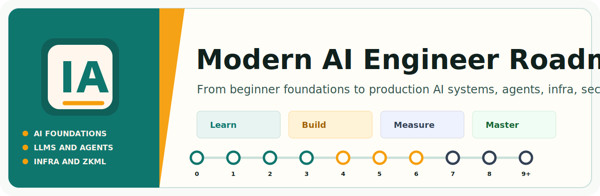

<div align="center">
  
</div>

# Modern AI Engineer Roadmap

Beginner-to-master roadmap for becoming a modern AI engineer: AI and ML
fundamentals, deep learning, LLMs, RAG, agents, model infrastructure,
optimization, hardware acceleration, AI security, blockchain, and ZKML.

The live site is intended for GitHub Pages:

https://aiZKP.github.io/modern-ai-engineer-roadmap/

Repository: https://github.com/marko898911/modern-ai-engineer-roadmap

## What Makes This Roadmap Different

This roadmap is designed to be walked, not admired from far away.

- It starts from beginner assumptions.
- It separates required foundations from specialist tracks.
- Every stage has a concrete build artifact and exit criteria.
- Advanced topics like agents, serving, CUDA, security, blockchain, and ZKML
  appear only after the learner has enough context to use them.
- The structure stays flat enough that a student can always answer:
  "Where am I, what comes next, and what should I build?"

## Project Structure

```text
modern-ai-engineer-roadmap/
|-- README.md
|-- mkdocs.yml
|-- requirements.txt
|-- docs/
|   |-- index.md
|   |-- how-to-use.md
|   |-- roadmap-map.md
|   |-- stages/
|   |   |-- 6. AI Agents/
|   |   |   |-- 6.0 Prerequisites/
|   |   |   |   |-- Basic Knowledge/
|   |   |   |   `-- ...
|   |   |   |-- 6.1 LLM Fundamentals/
|   |   |   |   |-- Agent Loop/
|   |   |   |   `-- ...
|   |   |   `-- 6.2 Prompt Engineering/
|   |   |       |-- Overview/
|   |   |       `-- Prompt Engineering Roadmap/
|   |-- tracks/
|   |-- projects/
|   |-- resources/
|   |-- meta/
|   `-- assets/
`-- .github/workflows/deploy-docs.yml
```

Each stage, sub-stage, and part is a folder with its own `index.md`.
Managers control the visible names in `mkdocs.yml`; contributors work inside
the matching part folder.

## Local Preview

```bash
python3 -m venv .venv
. .venv/bin/activate
pip install -r requirements.txt
mkdocs serve
```

Then open `http://127.0.0.1:8000/modern-ai-engineer-roadmap/`.
