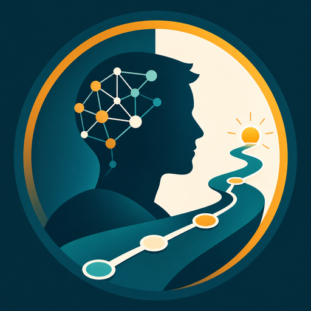

# Modern AI Engineer Roadmap

<div class="roadmap-hero" markdown="1">

<p class="roadmap-hero__title">From first principles to production AI systems.</p>
<p class="roadmap-hero__meta">A practical path for students who want to build AI products, understand LLMs and agents, operate models in production, optimize inference, and reach advanced security, blockchain, and ZKML work without getting lost.</p>
</div>

## The Promise

If a beginner reads this roadmap, they should know:

- what to learn now
- what can wait
- what to build at each stage
- how to prove progress
- which specialist path to choose later

This is not a collection of every possible AI topic. It is a path from
beginner to master, with enough depth to become dangerous in the good sense:
able to design, build, evaluate, ship, debug, and explain modern AI systems.

## The Shape

The roadmap has one main path and several specialist tracks.

| Level | Stage | Main question | Artifact |
|---|---|---|---|
| Beginner | [0. Orientation](<stages/0. Orientation/index.md>) | What is AI engineering? | learning log and setup |
| Beginner | [1. Foundations](<stages/1. Foundations/index.md>) | Can I program, reason, and use data? | Python data project |
| Beginner | [2. Machine Learning](<stages/2. Machine Learning/index.md>) | Can I train and evaluate classic models? | ML baseline report |
| Builder | [3. Deep Learning](<stages/3. Deep Learning/index.md>) | Can I build neural networks in PyTorch? | trained neural model |
| Builder | [4. LLMs](<stages/4. LLMs/index.md>) | Do I understand tokens, transformers, and generation? | LLM notebook |
| Builder | [5. AI Applications](<stages/5. AI Applications/index.md>) | Can I build reliable RAG and AI apps? | evaluated RAG app |
| Advanced | [6. AI Agents](<stages/6. AI Agents/index.md>) | Can I build tool-using agents safely? | agent loop with tools |
| Advanced | [7. Model Infrastructure](<stages/7. Model Infrastructure/index.md>) | Can I run model systems like software systems? | deployed model service |
| Advanced | [8. Optimization and Hardware](<stages/8. Optimization and Hardware/index.md>) | Can I make inference faster and cheaper? | benchmark and optimization report |
| Specialist | [9. Security, Blockchain, ZKML](<stages/9. Security, Blockchain, ZKML/index.md>) | Can I secure and verify AI systems? | threat model and ZKML proof |
| Master | [10. Mastery](<stages/10. Mastery/index.md>) | Can I own a full AI system end to end? | capstone portfolio |

## The Four Lanes

<div class="roadmap-grid" markdown="1">
<div class="roadmap-card" markdown="1">
### Product AI
LLM apps, RAG, UX, evaluation, feedback loops, prompt/version control.
</div>
<div class="roadmap-card" markdown="1">
### Agentic AI
Tool calling, memory, planning, MCP, orchestration, tracing, safety.
</div>
<div class="roadmap-card" markdown="1">
### AI Systems
Data pipelines, training, serving, MLOps, observability, cost, reliability.
</div>
<div class="roadmap-card" markdown="1">
### Trust and Acceleration
Inference optimization, GPUs, edge hardware, AI security, blockchain, ZKML.
</div>
</div>

## Minimum Completion Standard

Each stage uses the same quality bar:

<div class="quality-bar" markdown="1">
Learn the concept. Build one real artifact. Measure something. Debug one failure. Write down the lesson.
</div>

Weak completion:

```text
I watched videos about RAG and agents.
```

Strong completion:

```text
I built a RAG assistant, created 50 test questions, measured retrieval recall,
latency, and cost, found 3 prompt-injection failures, and wrote the fixes.
```

## Start Here

1. Read [How to Use](how-to-use.md).
2. Open the [Roadmap Map](roadmap-map.md).
3. Start Stage 0 unless you can already pass its exit criteria.
4. Use the [Project Ladder](projects/project-ladder.md) as your portfolio backbone.
