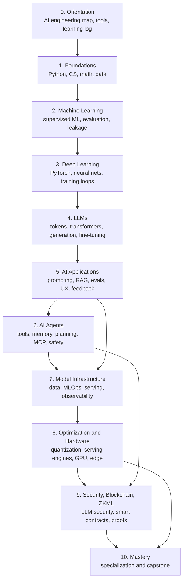

# Roadmap Map

## Main Path



## Track Shortcuts

| Goal | Path |
|---|---|
| AI application engineer | 0 -> 1 -> 2 -> 4 -> 5 -> 6 -> 7 |
| LLM engineer | 0 -> 1 -> 2 -> 3 -> 4 -> 5 -> 7 -> 8 |
| Agent engineer | 0 -> 1 -> 4 -> 5 -> 6 -> 7 -> 9 |
| ML systems engineer | 0 -> 1 -> 2 -> 3 -> 7 -> 8 -> 10 |
| Inference engineer | 0 -> 1 -> 3 -> 4 -> 7 -> 8 -> 10 |
| AI security and ZKML engineer | 0 -> 1 -> 4 -> 5 -> 6 -> 9 -> 10 |

## Topic Placement

| Topic | Where it belongs | Why |
|---|---|---|
| Basic AI concepts | Stage 0 to 2 | You need vocabulary before architecture |
| Deep learning | Stage 3 | Neural nets before transformers |
| LLMs | Stage 4 | Tokens, attention, generation, model limits |
| RAG | Stage 5 | It is an application pattern, not a beginner topic |
| Agents | Stage 6 | Agents need LLMs, tools, state, evals, and security |
| Model infra | Stage 7 | Production work needs monitoring and deployment |
| Optimization | Stage 8 | Optimize after you can measure |
| Hardware acceleration | Stage 8 | Hardware makes sense after workload math |
| Blockchain and ZKML | Stage 9 | Verification needs AI, security, and crypto basics |

## The Important Dependency

AI agents are not magic. They are AI applications with a loop.

```text
input -> model -> plan/reason -> tool call -> observation -> memory -> response
```

That loop only becomes useful after you understand prompts, structured outputs,
RAG, evals, tool boundaries, latency, and security. This is why agents come
after AI applications, not before them.
